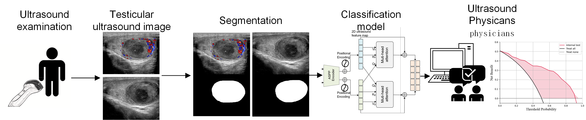
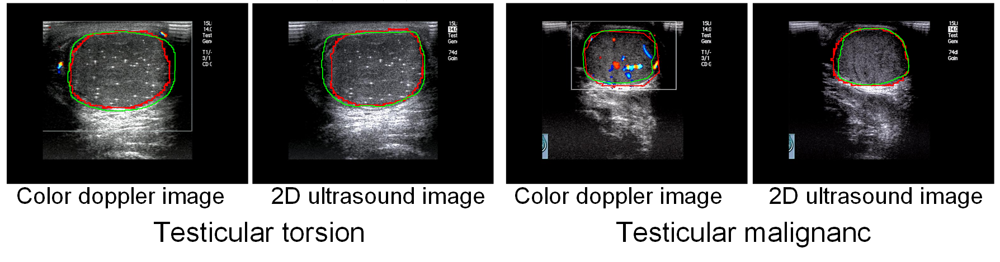
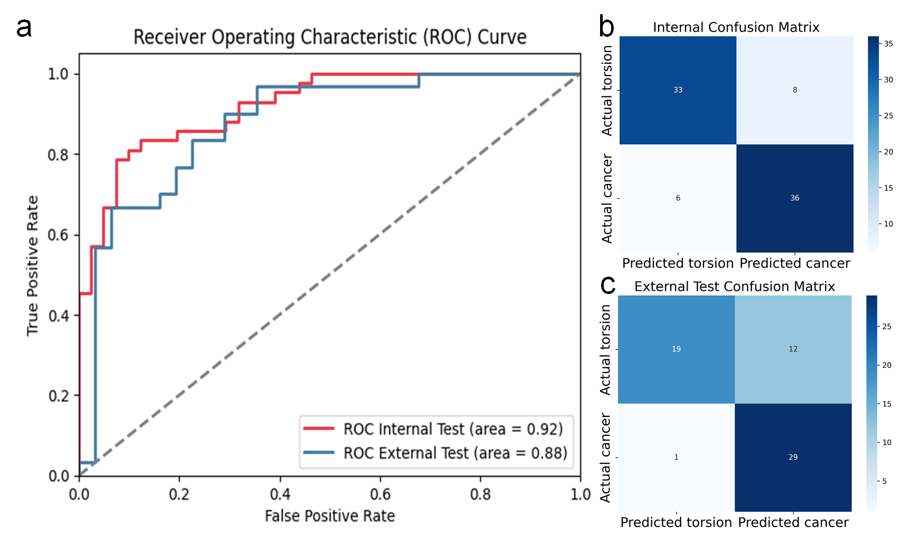

# Artificial Intelligence for Diagnosis of Testicular Torsion Based on Ultrasound Images

## Overview

This repository contains the code for the deep-learning model **Dual-ASPP** designed to assist in the diagnosis of **testicular torsion** based on **ultrasound images** (both grayscale and color Doppler). The model is developed to aid junior physicians in the timely and accurate diagnosis of testicular torsion, reducing inter-observer variability and improving diagnostic accuracy.

The overall pipeline of this study:


## Abstract

**Background**:  
Testicular torsion occurs when the spermatic cord rotates, compromising blood supply and leading to rapid ischemic necrosis of the testicle. This study aimed to develop and evaluate a deep-learning model based on ultrasound images to support junior physicians in diagnosing testicular torsion.

**Methods**:  
We developed the **Dual-ASPP model** that utilizes dual-modal ultrasound images, combining grayscale and color Doppler features. The model integrates these features via a multi-head cross-attention fusion module, improving diagnostic accuracy. We validated the model's performance on independent test sets and conducted decision curve analysis to assess its clinical utility. 

**Results**:  
The Dual-ASPP model achieved **AUCs of 0.92** and **0.88** on internal and external validation sets, respectively. Decision curve analysis demonstrated that the model significantly improved net clinical benefit across all threshold probabilities.



**Conclusions**:  
When used as a decision-support tool, the Dual-ASPP model significantly improved diagnostic accuracy among ultrasound physicians, especially junior practitioners. Incorporating this model into clinical workflows can enhance diagnostic performance and reduce observer variability in testicular torsion evaluations.

## Key Features

- **Dual-ASPP Model**: A novel deep learning model utilizing dual-modal grayscale and Doppler ultrasound images.
- **Multi-head Cross-Attention Fusion**: Integrates features from both image modalities to enhance the model's diagnostic accuracy.
- **Decision Curve Analysis**: Evaluates the clinical utility and potential value of the model in real-world settings.

## Installation

To run this project, ensure you have the following installed:

- Python 3.9
- PyTorch
- OpenCV

### Step-by-step installation:

1. Clone the repository:
   ```bash
   git clone https://github.com/yourusername/testicular-torsion-diagnosis.git
   cd testicular-torsion-diagnosis
2. Train the segmentation model:
    ```bash 
    python train_seg.py
3. Train the classification model:
    ```bash
    python train.py
4. Run test:
    ```bash
      python test.py
## Data Availability
The datasets generated and analyzed during the current study are not publicly available due to privacy and ethical restrictions but are available from the corresponding author on reasonable request. Requests for data access should be directed to the corresponding author and may require approval from the relevant institutional ethics committee.

## Citation
```
@article{Dual-ASPP_2025,
  title={Artificial intelligence for diagnosis of testicular torsion based on ultrasound images},
  author={Rongchen Wang, Liren Yang, Rong Ma, Yuexia Hu, Yang Chen},
  year={2025}
}

```
